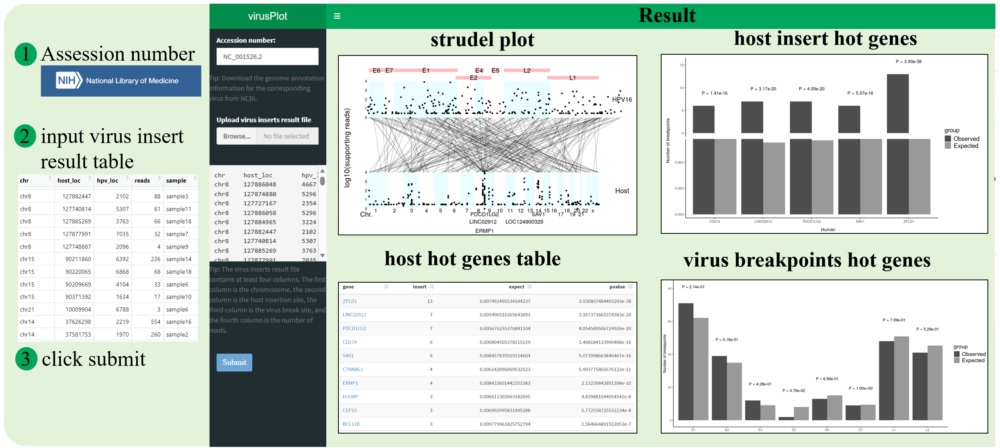

<!-- README.md is generated from README.Rmd. Please edit that file -->

```{r, include = FALSE}
knitr::opts_chunk$set(
  collapse = TRUE,
  comment = "#>",
  fig.path = "man/figures/README-",
  out.width = "100%"
)
```


# virusPlot

<!-- badges: start -->
<!-- badges: end -->
Visualization of virus insertion information

## :writing_hand: Authors
Erqiang Hu: Albert Einstein College of Medicine

Shanye Yin: Albert Einstein College of Medicine


##  :hammer: Installation
```{r eval=FALSE}
devtools::install_github("huerqiang/virusPlot")
```

## workflow


## Example

Download virus genome
```{r}
library(virusPlot)
genome <- get_virus_genom(accession_number = "NC_001526.2",
    email = "13766876214@163.com")
head(genome)
```

Download virus annotation
```{r}
gene_features <- get_virus_annotation(accession_number = "NC_001526.2",
    email = "13766876214@163.com")
virus_info <- deal_virus_annotation(gene_features)
virus_info
```


```{r fig.width=7, fig.height=7}
library(virusPlot)
virus_info <- data.frame(
         gene = c("E6", "E7", "E1", "E2", "E4", "E5", "L2", "L1"),
         start = c(83, 562, 865, 2755, 3332, 3849, 4236, 5560),
         end = c(559, 858, 2813, 3852, 3619, 4100, 5657, 7155))

insert_num <- data.frame(start = seq(1, 7801, 100),
    end = seq(101, 7901, 100),
    num = sample(1:28, 79, replace = TRUE))
circle_virus(virus_info, insert_num)
```


Users need to prepare an input dataframe containing specific columns that describe viral integration events. These columns include:  
  1. Chromosome: The chromosome number where the viral integration breakpoint is located in the host genome.  
  2. Host Position: The position of the breakpoint on the host genome.  
  3. Viral Position: The corresponding position on the viral genome.  
  4. Read Count: The number of reads supporting the integration event.  
  5. Sample ID (optional): The sample identifier, allowing for visualization of integration events across multiple samples.  
Here we provide the insert_info object as an example:  
```{r fig.width=10, fig.height=7}
data(insert_info)
# virus_info <- data.frame(
#       gene = c("E6", "E7", "E1", "E2", "E4", "E5", "L2", "L1", "LCR"),
#       start = c(83, 562, 865, 2755, 3332, 3849, 4236, 5560, 7200),
#       end = c(559, 858, 2813, 3852, 3619, 4100, 5657, 7155, 7904))
# HPV16
gene_features <- get_virus_annotation(accession_number = "NC_001526.2",
    email = "13766876214@163.com")
virus_info_NC_001526 <- deal_virus_annotation(gene_features)
strudel_plot(virus_info = virus_info_NC_001526, insert_info, 
             hot_gene = 3)

```

```{r fig.width=10, fig.height=7}
strudel_plot(virus_info = virus_info_NC_001526, insert_info, 
             hot_gene = 3, sample_select = c("sample1", "sample2", "sample3", "sample4", "sample5"))
```
hot genes of virus
```{r message=FALSE, warning=FALSE}
hot_gene <- get_hot_gene(virus_info = virus_info_NC_001526, insert_info)
insert_plot <- hot_gene_plot(hot_gene)
```

```{r fig.width=8, fig.height=7}
insert_plot[[2]]
```

```{r fig.width=10, fig.height=7}
strudel_plot(virus_info = virus_info_NC_001526, insert_info, 
             hot_gene = c( "SAV1", "ZPLD1", "CHMP6", "IRS4"))
```


```{r fig.width=10, fig.height=10}
data(vcf_matrix)
data(col)
data(pdata)
data(cli_colors)
oncoplot(vcf_matrix, varis_color = col, 
    clinical = pdata[, c("ID", "gender", "race", "stage", "hpv16")], 
    clinical_color = cli_colors, na.value = "#F3F5F7")
```

Run shinyapp
```{r eval=FALSE, message=FALSE, warning=FALSE}
run_virusPlot()
```


```{r}
sessionInfo()
```


