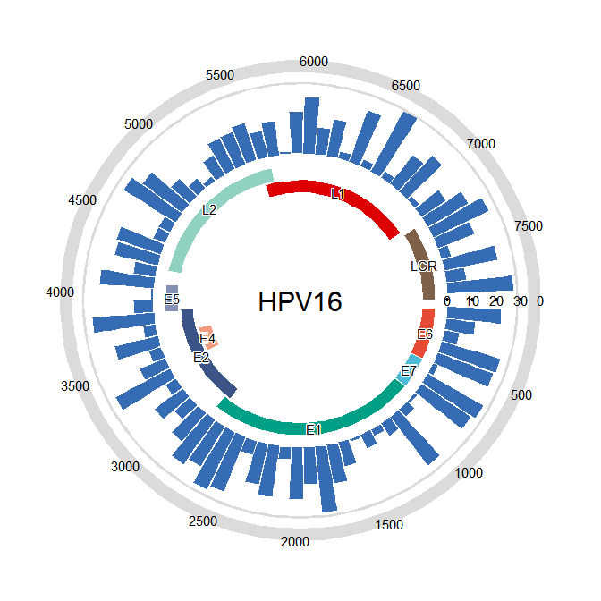
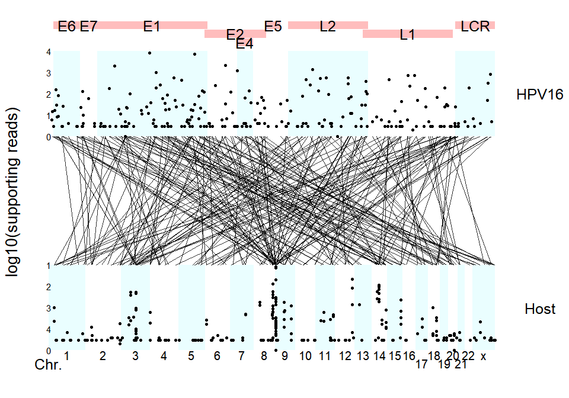

<!-- README.md is generated from README.Rmd. Please edit that file -->

# virusPlot

<!-- badges: start -->
<!-- badges: end -->

Visualization of virus insertion information

## :writing_hand: Authors

Erqiang Hu

Department of Bioinformatics, School of Basic Medical Sciences, Southern
Medical University.

## :hammer: Installation

``` r
devtools::install_github("huerqiang/virusPlot")
```

## Example

``` r
library(virusPlot)
virus_info <- data.frame(
         gene = c("E6", "E7", "E1", "E2", "E4", "E5", "L2", "L1", "LCR"),
         start = c(83, 562, 865, 2755, 3332, 3849, 4236, 5560, 7200),
         end = c(559, 858, 2813, 3852, 3619, 4100, 5657, 7155, 7904))

insert_num <- data.frame(start = seq(1, 7801, 100),
    end = seq(101, 7901, 100),
    num = sample(1:28, 79, replace = TRUE))
circle_virus(virus_info, insert_num)
#> Warning: Removed 1 rows containing missing values (`geom_col()`).
```



``` r
data(insert_info)
virus_info <- data.frame(
      gene = c("E6", "E7", "E1", "E2", "E4", "E5", "L2", "L1", "LCR"),
      start = c(83, 562, 865, 2755, 3332, 3849, 4236, 5560, 7200),
      end = c(559, 858, 2813, 3852, 3619, 4100, 5657, 7155, 7904))
strudel_plot(virus_info, insert_info)
```



``` r
sessionInfo()
#> R version 4.3.1 (2023-06-16 ucrt)
#> Platform: x86_64-w64-mingw32/x64 (64-bit)
#> Running under: Windows 11 x64 (build 22621)
#> 
#> Matrix products: default
#> 
#> 
#> locale:
#> [1] LC_COLLATE=Chinese (Simplified)_China.utf8 
#> [2] LC_CTYPE=Chinese (Simplified)_China.utf8   
#> [3] LC_MONETARY=Chinese (Simplified)_China.utf8
#> [4] LC_NUMERIC=C                               
#> [5] LC_TIME=Chinese (Simplified)_China.utf8    
#> 
#> time zone: Asia/Shanghai
#> tzcode source: internal
#> 
#> attached base packages:
#> [1] stats     graphics  grDevices utils     datasets  methods   base     
#> 
#> other attached packages:
#> [1] virusPlot_0.1.0
#> 
#> loaded via a namespace (and not attached):
#>  [1] gtable_0.3.4       dplyr_1.1.3        compiler_4.3.1     tidyselect_1.2.0  
#>  [5] aplot_0.2.2        gridGraphics_0.5-1 ggplotify_0.1.2    ggfun_0.1.3       
#>  [9] scales_1.2.1       yaml_2.3.7         fastmap_1.1.1      ggplot2_3.4.4     
#> [13] R6_2.5.1           labeling_0.4.3     generics_0.1.3     patchwork_1.1.3   
#> [17] knitr_1.44         yulab.utils_0.1.0  tibble_3.2.1       munsell_0.5.0     
#> [21] shadowtext_0.1.2   pillar_1.9.0       rlang_1.1.1        utf8_1.2.4        
#> [25] cachem_1.0.8       ggsci_3.0.0        xfun_0.40          fs_1.6.3          
#> [29] memoise_2.0.1      cli_3.6.1          withr_2.5.1        magrittr_2.0.3    
#> [33] digest_0.6.33      grid_4.3.1         rstudioapi_0.15.0  lifecycle_1.0.3   
#> [37] vctrs_0.6.4        evaluate_0.22      glue_1.6.2         farver_2.1.1      
#> [41] fansi_1.0.5        colorspace_2.1-0   rmarkdown_2.25     tools_4.3.1       
#> [45] pkgconfig_2.0.3    htmltools_0.5.6.1
```
