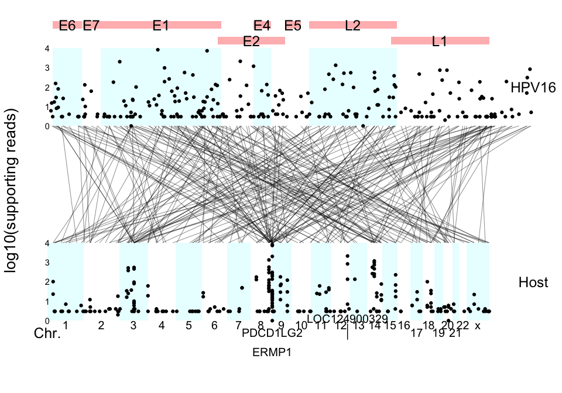

<!-- README.md is generated from README.Rmd. Please edit that file -->

# virusPlot

<!-- badges: start -->
<!-- badges: end -->

Visualization of virus insertion information

## :writing_hand: Authors

Erqiang Hu: Department of Bioinformatics, School of Basic Medical
Sciences, Southern Medical University.

Shanye Yin: Albert Einstein College of Medicine

## :hammer: Installation

``` r
devtools::install_github("huerqiang/virusPlot")
```

## workflow


## Example

Download virus genome

``` r
library(virusPlot)
#> 
#> 
genome <- get_virus_genom(accession_number = "NC_001526.2",
    email = "13766876214@163.com")
head(genome)
#>                                                                       V1
#> 1             >NC_001526.2 Human papillomavirus type 16, complete genome
#> 2 ACTACAATAATTCATGTATAAAACTAAGGGCGTAACCGAAATCGGTTGAACCGAAACCGGTTAGTATAAA
#> 3 AGCAGACATTTTATGCACCAAAAGAGAACTGCAATGTTTCAGGACCCACAGGAGCGACCCAGAAAGTTAC
#> 4 CACAGTTATGCACAGAGCTGCAAACAACTATACATGATATAATATTAGAATGTGTGTACTGCAAGCAACA
#> 5 GTTACTGCGACGTGAGGTATATGACTTTGCTTTTCGGGATTTATGCATAGTATATAGAGATGGGAATCCA
#> 6 TATGCTGTATGTGATAAATGTTTAAAGTTTTATTCTAAAATTAGTGAGTATAGACATTATTGTTATAGTT
```

Download virus annotation

``` r
gene_features <- get_virus_annotation(accession_number = "NC_001526.2",
    email = "13766876214@163.com")
virus_info <- deal_virus_annotation(gene_features)
virus_info
#>   gene start  end
#> 1   E6    83  559
#> 2   E7   562  858
#> 3   E1   865 2813
#> 4   E2  2755 3852
#> 5   E4  3332 3619
#> 6   E5  3849 4100
#> 7   L2  4236 5657
#> 8   L1  5560 7155
```

``` r
library(virusPlot)
virus_info <- data.frame(
         gene = c("E6", "E7", "E1", "E2", "E4", "E5", "L2", "L1", "LCR"),
         start = c(83, 562, 865, 2755, 3332, 3849, 4236, 5560, 7200),
         end = c(559, 858, 2813, 3852, 3619, 4100, 5657, 7155, 7904))

insert_num <- data.frame(start = seq(1, 7801, 100),
    end = seq(101, 7901, 100),
    num = sample(1:28, 79, replace = TRUE))
circle_virus(virus_info, insert_num)
#> Warning: Removed 1 rows containing missing values (`geom_col()`).
```


``` r
data(insert_info)
# virus_info <- data.frame(
#       gene = c("E6", "E7", "E1", "E2", "E4", "E5", "L2", "L1", "LCR"),
#       start = c(83, 562, 865, 2755, 3332, 3849, 4236, 5560, 7200),
#       end = c(559, 858, 2813, 3852, 3619, 4100, 5657, 7155, 7904))
# HPV16
gene_features <- get_virus_annotation(accession_number = "NC_001526.2",
    email = "13766876214@163.com")
virus_info_NC_001526 <- deal_virus_annotation(gene_features)
strudel_plot(virus_info = virus_info_NC_001526, insert_info, 
             hot_gene = 3)
#> >> done...                    2024-02-18 12:21:05
```



hot genes of virus

``` r
hot_gene <- get_hot_gene(virus_info = virus_info_NC_001526, insert_info)
#> >> done...                    2024-02-18 12:21:36
insert_plot <- hot_gene_plot(hot_gene)
```

``` r
insert_plot[[2]]
```


``` r
strudel_plot(virus_info = virus_info_NC_001526, insert_info, 
             hot_gene = c( "SAV1", "ZPLD1", "CHMP6", "IRS4"))
#> >> done...                    2024-02-18 12:22:07
```


``` r
data(vcf_matrix)
data(col)
data(pdata)
data(cli_colors)
oncoplot(vcf_matrix, varis_color = col, 
    clinical = pdata[, c("ID", "gender", "race", "stage", "hpv16")], 
    clinical_color = cli_colors, na.value = "#F3F5F7")
```


Run shinyapp

``` r
run_virusPlot()
```


``` r
sessionInfo()
#> R version 4.3.2 (2023-10-31 ucrt)
#> Platform: x86_64-w64-mingw32/x64 (64-bit)
#> Running under: Windows 11 x64 (build 22621)
#> 
#> Matrix products: default
#> 
#> 
#> locale:
#> [1] LC_COLLATE=Chinese (Simplified)_China.utf8 
#> [2] LC_CTYPE=Chinese (Simplified)_China.utf8   
#> [3] LC_MONETARY=Chinese (Simplified)_China.utf8
#> [4] LC_NUMERIC=C                               
#> [5] LC_TIME=Chinese (Simplified)_China.utf8    
#> 
#> time zone: Asia/Shanghai
#> tzcode source: internal
#> 
#> attached base packages:
#> [1] stats4    stats     graphics  grDevices utils     datasets  methods  
#> [8] base     
#> 
#> other attached packages:
#> [1] org.Hs.eg.db_3.18.0  AnnotationDbi_1.64.1 IRanges_2.36.0      
#> [4] S4Vectors_0.40.1     Biobase_2.62.0       BiocGenerics_0.48.1 
#> [7] virusPlot_0.1.1     
#> 
#> loaded via a namespace (and not attached):
#>   [1] splines_4.3.2                           
#>   [2] later_1.3.1                             
#>   [3] BiocIO_1.12.0                           
#>   [4] bitops_1.0-7                            
#>   [5] ggplotify_0.1.2                         
#>   [6] filelock_1.0.2                          
#>   [7] tibble_3.2.1                            
#>   [8] polyclip_1.10-6                         
#>   [9] XML_3.99-0.14                           
#>  [10] lifecycle_1.0.4                         
#>  [11] lattice_0.21-9                          
#>  [12] MASS_7.3-60                             
#>  [13] magrittr_2.0.3                          
#>  [14] plotly_4.10.3                           
#>  [15] rmarkdown_2.25                          
#>  [16] yaml_2.3.7                              
#>  [17] plotrix_3.8-4                           
#>  [18] httpuv_1.6.12                           
#>  [19] cowplot_1.1.1                           
#>  [20] DBI_1.1.3                               
#>  [21] RColorBrewer_1.1-3                      
#>  [22] golem_0.4.1                             
#>  [23] abind_1.4-5                             
#>  [24] zlibbioc_1.48.0                         
#>  [25] GenomicRanges_1.54.0                    
#>  [26] purrr_1.0.2                             
#>  [27] ggraph_2.1.0                            
#>  [28] RCurl_1.98-1.12                         
#>  [29] yulab.utils_0.0.9                       
#>  [30] tweenr_2.0.2                            
#>  [31] rappdirs_0.3.3                          
#>  [32] GenomeInfoDbData_1.2.11                 
#>  [33] enrichplot_1.23.1.991                   
#>  [34] ggrepel_0.9.4                           
#>  [35] rentrez_1.2.3                           
#>  [36] tidytree_0.4.5                          
#>  [37] ChIPseeker_1.39.0                       
#>  [38] codetools_0.2-19                        
#>  [39] DelayedArray_0.28.0                     
#>  [40] DNAcopy_1.76.0                          
#>  [41] DOSE_3.29.1.991                         
#>  [42] xml2_1.3.5                              
#>  [43] ggforce_0.4.1                           
#>  [44] tidyselect_1.2.0                        
#>  [45] aplot_0.2.1                             
#>  [46] farver_2.1.1                            
#>  [47] viridis_0.6.4                           
#>  [48] matrixStats_1.0.0                       
#>  [49] BiocFileCache_2.10.1                    
#>  [50] GenomicAlignments_1.38.0                
#>  [51] jsonlite_1.8.8                          
#>  [52] ellipsis_0.3.2                          
#>  [53] tidygraph_1.2.3                         
#>  [54] ggbreak_0.1.2                           
#>  [55] survival_3.5-7                          
#>  [56] tools_4.3.2                             
#>  [57] progress_1.2.2                          
#>  [58] treeio_1.26.0                           
#>  [59] TxDb.Hsapiens.UCSC.hg19.knownGene_3.2.2 
#>  [60] ggstar_1.0.4                            
#>  [61] Rcpp_1.0.12                             
#>  [62] glue_1.7.0                              
#>  [63] gridExtra_2.3                           
#>  [64] SparseArray_1.2.0                       
#>  [65] xfun_0.40                               
#>  [66] qvalue_2.34.0                           
#>  [67] MatrixGenerics_1.14.0                   
#>  [68] GenomeInfoDb_1.38.1                     
#>  [69] dplyr_1.1.4                             
#>  [70] shinydashboard_0.7.2                    
#>  [71] withr_3.0.0                             
#>  [72] BiocManager_1.30.22                     
#>  [73] fastmap_1.1.1                           
#>  [74] boot_1.3-28.1                           
#>  [75] fansi_1.0.6                             
#>  [76] caTools_1.18.2                          
#>  [77] digest_0.6.33                           
#>  [78] R6_2.5.1                                
#>  [79] mime_0.12                               
#>  [80] gridGraphics_0.5-1                      
#>  [81] colorspace_2.1-0                        
#>  [82] GO.db_3.18.0                            
#>  [83] gtools_3.9.4                            
#>  [84] biomaRt_2.58.0                          
#>  [85] RSQLite_2.3.1                           
#>  [86] config_0.3.2                            
#>  [87] ggsci_3.0.0                             
#>  [88] utf8_1.2.4                              
#>  [89] tidyr_1.3.0                             
#>  [90] generics_0.1.3                          
#>  [91] data.table_1.14.8                       
#>  [92] rtracklayer_1.62.0                      
#>  [93] htmlwidgets_1.6.3                       
#>  [94] prettyunits_1.2.0                       
#>  [95] graphlayouts_1.0.1                      
#>  [96] httr_1.4.7                              
#>  [97] S4Arrays_1.2.0                          
#>  [98] scatterpie_0.2.1                        
#>  [99] pkgconfig_2.0.3                         
#> [100] gtable_0.3.4                            
#> [101] blob_1.2.4                              
#> [102] XVector_0.42.0                          
#> [103] shadowtext_0.1.2                        
#> [104] htmltools_0.5.7                         
#> [105] fgsea_1.28.0                            
#> [106] scales_1.3.0                            
#> [107] TxDb.Hsapiens.UCSC.hg38.knownGene_3.18.0
#> [108] png_0.1-8                               
#> [109] attempt_0.3.1                           
#> [110] ggfun_0.1.3                             
#> [111] knitr_1.45                              
#> [112] rstudioapi_0.15.0                       
#> [113] reshape2_1.4.4                          
#> [114] rjson_0.2.21                            
#> [115] nlme_3.1-163                            
#> [116] curl_5.1.0                              
#> [117] cachem_1.0.8                            
#> [118] stringr_1.5.1                           
#> [119] BiocVersion_3.18.1                      
#> [120] KernSmooth_2.23-22                      
#> [121] parallel_4.3.2                          
#> [122] HDO.db_0.99.1                           
#> [123] restfulr_0.0.15                         
#> [124] pillar_1.9.0                            
#> [125] grid_4.3.2                              
#> [126] vctrs_0.6.5                             
#> [127] gplots_3.1.3                            
#> [128] promises_1.2.1                          
#> [129] dbplyr_2.4.0                            
#> [130] xtable_1.8-4                            
#> [131] evaluate_0.23                           
#> [132] GenomicFeatures_1.54.1                  
#> [133] cli_3.6.2                               
#> [134] compiler_4.3.2                          
#> [135] Rsamtools_2.18.0                        
#> [136] rlang_1.1.3                             
#> [137] crayon_1.5.2                            
#> [138] labeling_0.4.3                          
#> [139] aplotExtra_0.0.2                        
#> [140] forcats_1.0.0                           
#> [141] maftools_2.18.0                         
#> [142] plyr_1.8.9                              
#> [143] stringi_1.7.12                          
#> [144] viridisLite_0.4.2                       
#> [145] BiocParallel_1.36.0                     
#> [146] munsell_0.5.0                           
#> [147] Biostrings_2.70.1                       
#> [148] lazyeval_0.2.2                          
#> [149] GOSemSim_2.28.0                         
#> [150] Matrix_1.6-4                            
#> [151] hms_1.1.3                               
#> [152] patchwork_1.1.3                         
#> [153] bit64_4.0.5                             
#> [154] ggplot2_3.4.4                           
#> [155] KEGGREST_1.42.0                         
#> [156] shiny_1.8.0                             
#> [157] highr_0.10                              
#> [158] SummarizedExperiment_1.32.0             
#> [159] interactiveDisplayBase_1.40.0           
#> [160] AnnotationHub_3.10.0                    
#> [161] igraph_1.5.1                            
#> [162] memoise_2.0.1                           
#> [163] ggtree_3.10.0                           
#> [164] fastmatch_1.1-4                         
#> [165] bit_4.0.5                               
#> [166] ape_5.7-1
```
