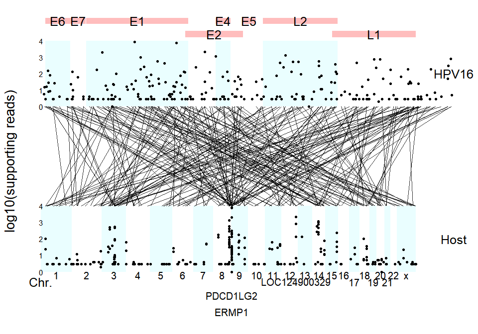

<!-- README.md is generated from README.Rmd. Please edit that file -->

# virusPlot

<!-- badges: start -->
<!-- badges: end -->

Visualization of virus insertion information

## :writing_hand: Authors

Erqiang Hu: Department of Bioinformatics, School of Basic Medical
Sciences, Southern Medical University.

Shanye Yin: Albert Einstein College of Medicine

## :hammer: Installation

``` r
devtools::install_github("huerqiang/virusPlot")
```

## Example

Download virus genome

``` r
library(virusPlot)
genome <- get_virus_genom(accession_number = "NC_001526.2",
    email = "13766876214@163.com")
head(genome)
#>                                                                       V1
#> 1             >NC_001526.2 Human papillomavirus type 16, complete genome
#> 2 ACTACAATAATTCATGTATAAAACTAAGGGCGTAACCGAAATCGGTTGAACCGAAACCGGTTAGTATAAA
#> 3 AGCAGACATTTTATGCACCAAAAGAGAACTGCAATGTTTCAGGACCCACAGGAGCGACCCAGAAAGTTAC
#> 4 CACAGTTATGCACAGAGCTGCAAACAACTATACATGATATAATATTAGAATGTGTGTACTGCAAGCAACA
#> 5 GTTACTGCGACGTGAGGTATATGACTTTGCTTTTCGGGATTTATGCATAGTATATAGAGATGGGAATCCA
#> 6 TATGCTGTATGTGATAAATGTTTAAAGTTTTATTCTAAAATTAGTGAGTATAGACATTATTGTTATAGTT
```

Download virus annotation

``` r
gene_features <- get_virus_annotation(accession_number = "NC_001526.2",
    email = "13766876214@163.com")
#> No encoding supplied: defaulting to UTF-8.
virus_info <- deal_virus_annotation(gene_features)
virus_info
#>   gene start  end
#> 1   E6    83  559
#> 2   E7   562  858
#> 3   E1   865 2813
#> 4   E2  2755 3852
#> 5   E4  3332 3619
#> 6   E5  3849 4100
#> 7   L2  4236 5657
#> 8   L1  5560 7155
```

``` r
library(virusPlot)
virus_info <- data.frame(
         gene = c("E6", "E7", "E1", "E2", "E4", "E5", "L2", "L1", "LCR"),
         start = c(83, 562, 865, 2755, 3332, 3849, 4236, 5560, 7200),
         end = c(559, 858, 2813, 3852, 3619, 4100, 5657, 7155, 7904))

insert_num <- data.frame(start = seq(1, 7801, 100),
    end = seq(101, 7901, 100),
    num = sample(1:28, 79, replace = TRUE))
circle_virus(virus_info, insert_num)
#> Warning: Removed 1 rows containing missing values (`geom_col()`).
```


``` r
data(insert_info)
virus_info <- data.frame(
      gene = c("E6", "E7", "E1", "E2", "E4", "E5", "L2", "L1", "LCR"),
      start = c(83, 562, 865, 2755, 3332, 3849, 4236, 5560, 7200),
      end = c(559, 858, 2813, 3852, 3619, 4100, 5657, 7155, 7904))
strudel_plot(virus_info, insert_info)
```


``` r
data(vcf_matrix)
data(col)
data(pdata)
data(cli_colors)
oncoplot(vcf_matrix, varis_color = col, 
    clinical = pdata[, c("ID", "gender", "race", "stage", "hpv16")], 
    clinical_color = cli_colors, na.value = "#F3F5F7")
```



``` r
sessionInfo()
#> R version 4.3.2 (2023-10-31 ucrt)
#> Platform: x86_64-w64-mingw32/x64 (64-bit)
#> Running under: Windows 11 x64 (build 22621)
#> 
#> Matrix products: default
#> 
#> 
#> locale:
#> [1] LC_COLLATE=Chinese (Simplified)_China.utf8 
#> [2] LC_CTYPE=Chinese (Simplified)_China.utf8   
#> [3] LC_MONETARY=Chinese (Simplified)_China.utf8
#> [4] LC_NUMERIC=C                               
#> [5] LC_TIME=Chinese (Simplified)_China.utf8    
#> 
#> time zone: Asia/Shanghai
#> tzcode source: internal
#> 
#> attached base packages:
#> [1] stats     graphics  grDevices utils     datasets  methods   base     
#> 
#> other attached packages:
#> [1] virusPlot_0.1.0
#> 
#> loaded via a namespace (and not attached):
#>  [1] yulab.utils_0.0.9  tidyr_1.3.0        utf8_1.2.4         generics_0.1.3    
#>  [5] ggplotify_0.1.2    maftools_2.18.0    lattice_0.21-9     digest_0.6.33     
#>  [9] magrittr_2.0.3     shadowtext_0.1.2   RColorBrewer_1.1-3 evaluate_0.23     
#> [13] grid_4.3.2         fastmap_1.1.1      Matrix_1.6-4       jsonlite_1.8.8    
#> [17] survival_3.5-7     gridExtra_2.3      httr_1.4.7         purrr_1.0.2       
#> [21] fansi_1.0.6        aplot_0.2.1        scales_1.3.0       ggstar_1.0.4      
#> [25] XML_3.99-0.14      cli_3.6.2          rlang_1.1.3        splines_4.3.2     
#> [29] munsell_0.5.0      withr_3.0.0        cachem_1.0.8       yaml_2.3.7        
#> [33] DNAcopy_1.76.0     tools_4.3.2        memoise_2.0.1      dplyr_1.1.4       
#> [37] colorspace_2.1-0   ggplot2_3.4.4      forcats_1.0.0      curl_5.1.0        
#> [41] vctrs_0.6.5        R6_2.5.1           gridGraphics_0.5-1 lifecycle_1.0.4   
#> [45] ggfun_0.1.3        pkgconfig_2.0.3    pillar_1.9.0       rentrez_1.2.3     
#> [49] gtable_0.3.4       data.table_1.14.8  glue_1.7.0         aplotExtra_0.0.2  
#> [53] xfun_0.40          tibble_3.2.1       tidyselect_1.2.0   highr_0.10        
#> [57] rstudioapi_0.15.0  knitr_1.45         farver_2.1.1       htmltools_0.5.7   
#> [61] patchwork_1.1.3    rmarkdown_2.25     ggsci_3.0.0        labeling_0.4.3    
#> [65] compiler_4.3.2
```
