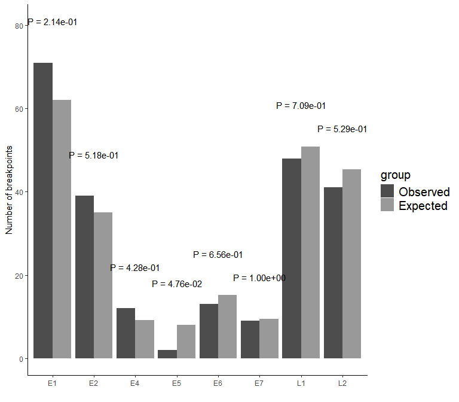
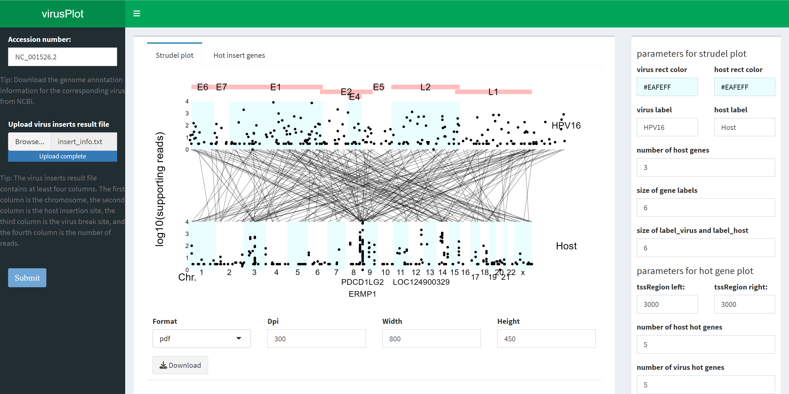

<!-- README.md is generated from README.Rmd. Please edit that file -->

# virusPlot

<!-- badges: start -->

<!-- badges: end -->

Visualization of virus insertion information

## :writing_hand: Authors

Erqiang Hu: Albert Einstein College of Medicine

Shanye Yin: Albert Einstein College of Medicine

## Availability and implementation

The R package version is available at:
<https://github.com/huerqiang/virusPlot>. The web version of virusPlot
is available at:
(<http://www.huerqiang.com:58211/app/virusplot>)\[<http://www.huerqiang.com:58211/app/virusplot>\].

## :hammer: Installation

``` r
devtools::install_github("huerqiang/virusPlot")
```

## workflow


## Example

Download virus genome

``` r
library(virusPlot)
#> 
#> 
genome <- get_virus_genom(accession_number = "NC_001526.2",
    email = "13766876214@163.com")
head(genome)
#>                                                                       V1
#> 1             >NC_001526.2 Human papillomavirus type 16, complete genome
#> 2 ACTACAATAATTCATGTATAAAACTAAGGGCGTAACCGAAATCGGTTGAACCGAAACCGGTTAGTATAAA
#> 3 AGCAGACATTTTATGCACCAAAAGAGAACTGCAATGTTTCAGGACCCACAGGAGCGACCCAGAAAGTTAC
#> 4 CACAGTTATGCACAGAGCTGCAAACAACTATACATGATATAATATTAGAATGTGTGTACTGCAAGCAACA
#> 5 GTTACTGCGACGTGAGGTATATGACTTTGCTTTTCGGGATTTATGCATAGTATATAGAGATGGGAATCCA
#> 6 TATGCTGTATGTGATAAATGTTTAAAGTTTTATTCTAAAATTAGTGAGTATAGACATTATTGTTATAGTT
```

Download virus annotation

``` r
gene_features <- get_virus_annotation(accession_number = "NC_001526.2",
    email = "13766876214@163.com")
virus_info <- deal_virus_annotation(gene_features)
virus_info
#>   gene start  end
#> 1   E6    83  559
#> 2   E7   562  858
#> 3   E1   865 2813
#> 4   E2  2755 3852
#> 5   E4  3332 3619
#> 6   E5  3849 4100
#> 7   L2  4236 5657
#> 8   L1  5560 7155
```

``` r
library(virusPlot)
virus_info <- data.frame(
         gene = c("E6", "E7", "E1", "E2", "E4", "E5", "L2", "L1"),
         start = c(83, 562, 865, 2755, 3332, 3849, 4236, 5560),
         end = c(559, 858, 2813, 3852, 3619, 4100, 5657, 7155))

insert_num <- data.frame(start = seq(1, 7801, 100),
    end = seq(101, 7901, 100),
    num = sample(1:28, 79, replace = TRUE))
circle_virus(virus_info, insert_num)
#> Warning: Removed 8 rows containing missing values or values outside the scale range
#> (`geom_col()`).
#> Warning: Removed 1 row containing missing values or values outside the scale range
#> (`geom_rect()`).
#> Removed 1 row containing missing values or values outside the scale range
#> (`geom_rect()`).
#> Warning: Removed 1 row containing missing values or values outside the scale range
#> (`geom_text()`).
```


Users need to prepare an input dataframe containing specific columns
that describe viral integration events. These columns include:  
1. Chromosome: The chromosome number where the viral integration
breakpoint is located in the host genome.  
2. Host Position: The position of the breakpoint on the host genome.  
3. Viral Position: The corresponding position on the viral genome.  
4. Read Count: The number of reads supporting the integration event.  
5. Sample ID (optional): The sample identifier, allowing for
visualization of integration events across multiple samples.  
Here we provide the insert_info object as an example:

``` r
data(insert_info)
head(insert_info)
#>    chr  host_loc hpv_loc reads   sample
#> 1 chr8 127886048    4667  1310  sample8
#> 2 chr8 127874880    5296   563  sample8
#> 3 chr8 127727167    2354   415 sample19
#> 4 chr8 127886058    5296   292  sample2
#> 5 chr8 127884965    3224   122 sample19
#> 6 chr8 127882447    2102    88  sample3
```

``` r

# virus_info <- data.frame(
#       gene = c("E6", "E7", "E1", "E2", "E4", "E5", "L2", "L1", "LCR"),
#       start = c(83, 562, 865, 2755, 3332, 3849, 4236, 5560, 7200),
#       end = c(559, 858, 2813, 3852, 3619, 4100, 5657, 7155, 7904))
# HPV16
gene_features <- get_virus_annotation(accession_number = "NC_001526.2",
    email = "13766876214@163.com")
virus_info_NC_001526 <- deal_virus_annotation(gene_features)
strudel_plot(virus_info = virus_info_NC_001526, insert_info, 
             hot_gene = 3)
```


``` r
strudel_plot(virus_info = virus_info_NC_001526, insert_info, 
             hot_gene = 3, sample_select = c("sample1", "sample2", "sample3", "sample4", "sample5"))
```

 hot
genes of virus

``` r
hot_gene <- get_hot_gene(virus_info = virus_info_NC_001526, insert_info)
insert_plot <- hot_gene_plot(hot_gene)
```

``` r
insert_plot[[2]]
```



``` r
strudel_plot(virus_info = virus_info_NC_001526, insert_info, 
             hot_gene = c( "SAV1", "ZPLD1", "CHMP6", "IRS4"))
```


``` r
data(vcf_matrix)
data(col)
data(pdata)
data(cli_colors)
oncoplot(vcf_matrix, varis_color = col, 
    clinical = pdata[, c("ID", "gender", "race", "stage", "hpv16")], 
    clinical_color = cli_colors, na.value = "#F3F5F7")
```


Run shinyapp

``` r
run_virusPlot()
```



``` r
sessionInfo()
#> R version 4.4.1 (2024-06-14)
#> Platform: aarch64-apple-darwin20
#> Running under: macOS 15.2
#> 
#> Matrix products: default
#> BLAS:   /Library/Frameworks/R.framework/Versions/4.4-arm64/Resources/lib/libRblas.0.dylib 
#> LAPACK: /Library/Frameworks/R.framework/Versions/4.4-arm64/Resources/lib/libRlapack.dylib;  LAPACK version 3.12.0
#> 
#> locale:
#> [1] en_US.UTF-8/en_US.UTF-8/en_US.UTF-8/C/en_US.UTF-8/en_US.UTF-8
#> 
#> time zone: America/New_York
#> tzcode source: internal
#> 
#> attached base packages:
#> [1] stats4    stats     graphics  grDevices utils     datasets  methods  
#> [8] base     
#> 
#> other attached packages:
#> [1] org.Hs.eg.db_3.19.1  AnnotationDbi_1.66.0 IRanges_2.38.1      
#> [4] S4Vectors_0.42.1     Biobase_2.64.0       BiocGenerics_0.50.0 
#> [7] virusPlot_0.1.5     
#> 
#> loaded via a namespace (and not attached):
#>   [1] splines_4.4.1                           
#>   [2] later_1.4.1                             
#>   [3] BiocIO_1.14.0                           
#>   [4] bitops_1.0-9                            
#>   [5] ggplotify_0.1.2                         
#>   [6] tibble_3.2.1                            
#>   [7] R.oo_1.27.0                             
#>   [8] polyclip_1.10-7                         
#>   [9] XML_3.99-0.17                           
#>  [10] lifecycle_1.0.4                         
#>  [11] httr2_1.0.6                             
#>  [12] lattice_0.22-6                          
#>  [13] MASS_7.3-61                             
#>  [14] magrittr_2.0.3                          
#>  [15] plotly_4.10.4                           
#>  [16] rmarkdown_2.29                          
#>  [17] yaml_2.3.10                             
#>  [18] plotrix_3.8-4                           
#>  [19] httpuv_1.6.15                           
#>  [20] cowplot_1.1.3                           
#>  [21] DBI_1.2.3                               
#>  [22] RColorBrewer_1.1-3                      
#>  [23] golem_0.5.1                             
#>  [24] abind_1.4-8                             
#>  [25] zlibbioc_1.50.0                         
#>  [26] GenomicRanges_1.56.2                    
#>  [27] purrr_1.0.2                             
#>  [28] R.utils_2.12.3                          
#>  [29] ggraph_2.2.1                            
#>  [30] RCurl_1.98-1.16                         
#>  [31] yulab.utils_0.1.9.001                   
#>  [32] tweenr_2.0.3                            
#>  [33] rappdirs_0.3.3                          
#>  [34] GenomeInfoDbData_1.2.12                 
#>  [35] enrichplot_1.24.4                       
#>  [36] ggrepel_0.9.6                           
#>  [37] tidytree_0.4.6                          
#>  [38] rentrez_1.2.3                           
#>  [39] ChIPseeker_1.40.0                       
#>  [40] codetools_0.2-20                        
#>  [41] DelayedArray_0.30.1                     
#>  [42] DOSE_3.30.5                             
#>  [43] DNAcopy_1.78.0                          
#>  [44] ggforce_0.4.2                           
#>  [45] tidyselect_1.2.1                        
#>  [46] aplot_0.2.3                             
#>  [47] UCSC.utils_1.0.0                        
#>  [48] farver_2.1.2                            
#>  [49] viridis_0.6.5                           
#>  [50] matrixStats_1.4.1                       
#>  [51] GenomicAlignments_1.40.0                
#>  [52] jsonlite_1.8.9                          
#>  [53] tidygraph_1.3.1                         
#>  [54] ggbreak_0.1.2                           
#>  [55] survival_3.7-0                          
#>  [56] tools_4.4.1                             
#>  [57] treeio_1.28.0                           
#>  [58] TxDb.Hsapiens.UCSC.hg19.knownGene_3.2.2 
#>  [59] ggstar_1.0.4                            
#>  [60] Rcpp_1.0.13-1                           
#>  [61] glue_1.8.0                              
#>  [62] gridExtra_2.3                           
#>  [63] SparseArray_1.4.8                       
#>  [64] xfun_0.49                               
#>  [65] qvalue_2.36.0                           
#>  [66] MatrixGenerics_1.16.0                   
#>  [67] GenomeInfoDb_1.40.1                     
#>  [68] dplyr_1.1.4                             
#>  [69] shinydashboard_0.7.2                    
#>  [70] withr_3.0.2                             
#>  [71] fastmap_1.2.0                           
#>  [72] boot_1.3-31                             
#>  [73] fansi_1.0.6                             
#>  [74] caTools_1.18.3                          
#>  [75] digest_0.6.37                           
#>  [76] R6_2.5.1                                
#>  [77] mime_0.12                               
#>  [78] gridGraphics_0.5-1                      
#>  [79] colorspace_2.1-1                        
#>  [80] GO.db_3.19.1                            
#>  [81] gtools_3.9.5                            
#>  [82] RSQLite_2.3.7                           
#>  [83] R.methodsS3_1.8.2                       
#>  [84] config_0.3.2                            
#>  [85] utf8_1.2.4                              
#>  [86] tidyr_1.3.1                             
#>  [87] generics_0.1.3                          
#>  [88] ggsci_3.2.0                             
#>  [89] data.table_1.16.4                       
#>  [90] rtracklayer_1.64.0                      
#>  [91] graphlayouts_1.2.0                      
#>  [92] httr_1.4.7                              
#>  [93] htmlwidgets_1.6.4                       
#>  [94] S4Arrays_1.4.1                          
#>  [95] scatterpie_0.2.4                        
#>  [96] pkgconfig_2.0.3                         
#>  [97] gtable_0.3.6                            
#>  [98] blob_1.2.4                              
#>  [99] XVector_0.44.0                          
#> [100] shadowtext_0.1.4                        
#> [101] htmltools_0.5.8.1                       
#> [102] fgsea_1.30.0                            
#> [103] scales_1.3.0                            
#> [104] TxDb.Hsapiens.UCSC.hg38.knownGene_3.18.0
#> [105] png_0.1-8                               
#> [106] attempt_0.3.1                           
#> [107] ggfun_0.1.8                             
#> [108] knitr_1.49                              
#> [109] rstudioapi_0.17.1                       
#> [110] reshape2_1.4.4                          
#> [111] rjson_0.2.23                            
#> [112] nlme_3.1-166                            
#> [113] curl_6.0.1                              
#> [114] cachem_1.1.0                            
#> [115] stringr_1.5.1                           
#> [116] KernSmooth_2.23-24                      
#> [117] parallel_4.4.1                          
#> [118] restfulr_0.0.15                         
#> [119] pillar_1.9.0                            
#> [120] grid_4.4.1                              
#> [121] vctrs_0.6.5                             
#> [122] gplots_3.2.0                            
#> [123] promises_1.3.2                          
#> [124] xtable_1.8-4                            
#> [125] evaluate_1.0.1                          
#> [126] GenomicFeatures_1.56.0                  
#> [127] cli_3.6.3                               
#> [128] compiler_4.4.1                          
#> [129] Rsamtools_2.20.0                        
#> [130] rlang_1.1.4                             
#> [131] crayon_1.5.3                            
#> [132] labeling_0.4.3                          
#> [133] aplotExtra_0.0.2                        
#> [134] forcats_1.0.0                           
#> [135] maftools_2.20.0                         
#> [136] plyr_1.8.9                              
#> [137] fs_1.6.5                                
#> [138] stringi_1.8.4                           
#> [139] viridisLite_0.4.2                       
#> [140] BiocParallel_1.38.0                     
#> [141] munsell_0.5.1                           
#> [142] Biostrings_2.72.1                       
#> [143] lazyeval_0.2.2                          
#> [144] GOSemSim_2.30.2                         
#> [145] Matrix_1.7-1                            
#> [146] patchwork_1.3.0                         
#> [147] bit64_4.5.2                             
#> [148] ggplot2_3.5.1                           
#> [149] KEGGREST_1.44.1                         
#> [150] shiny_1.9.1                             
#> [151] SummarizedExperiment_1.34.0             
#> [152] igraph_2.1.1                            
#> [153] memoise_2.0.1                           
#> [154] ggtree_3.12.0                           
#> [155] fastmatch_1.1-4                         
#> [156] bit_4.5.0                               
#> [157] ape_5.8
```
